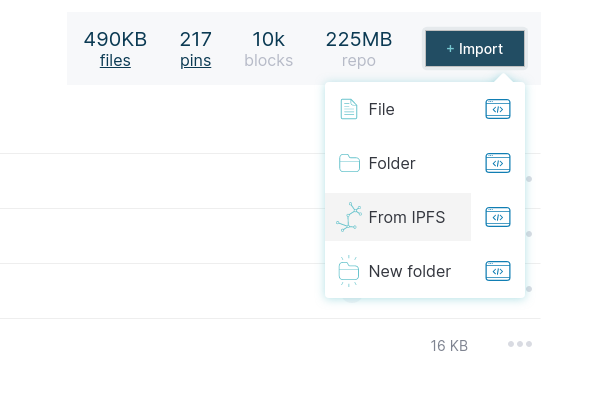

# Segítek a lázadóknak

Ez egy [IPFS](https://en.wikipedia.org/wiki/InterPlanetary_File_System) alapú blog, ami lehetővé teszi fájlok vagy egyéb adatok decentralizált megosztását. Hasonlít a torrentre, de az IPFS weboldalakat is képes megosztani ilyen módon, vagy bármilyen más adatot. Ha segíteni szeretnél a lázadóknak, beszállhatsz a fájlok megosztásába, a saját számítógépeddel.

Először mindenképpen fel kell telepítened az IPFS-t. Az IPFS telepítésének hivatalos dokumentációja [itt](https://docs.ipfs.io/install/ipfs-desktop/) található. Ez a dokumentáció [erre](https://github.com/ipfs/ipfs-desktop/releases) a weboldalra fog átírányítani, ahol (Windows esetében) egy olyasmi sort kell keresni, ami így néz ki: `IPFS-Desktop-Setup-0.14.0.exe`. A legújabb stabil verziót telepítsed.

A fenti lépés akkor van kész, ha eljutsz egy ehhez hasonló felülethez:


Ezt követően több lehetőséged van: vagy mindig a legfrissebb blogot szeretnéd megosztani, vagy csak a jelenlegi verziót, utóbbi esetében nem szükséges egyéb program letöltése. Előbbi esetében futtatni kell egy programot, ami folyamatosan ellenőrzi, hogy fel lett-e töltve újabb cikk a blogra.

## Frissítő program letöltése

Ha azt szeretnéd, ha a számítógéped mindig a legújabb verziót osztaná meg, akkor le kell töltened [ezt a programot](ipfs-blog-daemon) és ennek a programnak a számítógép indításakor mindig el kell indulnia. Ha esetleg nem tudod, hogy hogyan kell automatikusan futtatni egy programot minden indításkor, itt van néhány leírás: [Windows10](https://megnyitasa.com/blog/programok-hozzaadasa-inditashoz-a-windows-10-rendszerben/), [Windows 7,8, 10](https://www.laptopszaki.hu/blog/2016-04-05/tippek-trukkok-programok-hozzaadasa-az-automatikus-inditashoz).Az IPFS-t is ehhez hasonlóan automatikusan el kell indítani minden bekapcsoláskor.


## Csak a jelenlegi állapot lemásolása

(Ha a fenti opciót választottad, akkor ezt már nem kell megcsinálnod). Az IPFS Desktop alkalmazásban válaszd a `Files` (Fájlok) menüpontot, és kattints az 'Import' gombra, ami előtt egy kis plusz jel van. 



A legördüli menüből válaszd a 'From IPFS' opciót (a harmadik) Ezt a három dolgot kell hozzáadnod (külön-külön):
```
/ipfs/QmYZZqxjxW1Ph5Kus3EEwin6Z82XAG95B1r2Bs6b8AApsG
/ipfs/QmWZWwk2daTZCmDhCuhaNHktaTX9YyENeEruRv3kisNPMW
/ipfs/QmTcGretNL7bALnFj81JPU4Z8FZdAoK1EAZnww7pBHDDMb
```


Ha többre vagy kiváncsi, olvasd el a [haladóknak szóló leírást](https://ipfs.io/ipns/k2k4r8klkhk0uh1b3lytws5o724z2a7qiyto4jroedt8yh4huib1mhij/article.html?cid=QmRUWgCp74JWb8pBRgdJgp3JaDzumT8UG5D5uXE4wEy8kW) is.